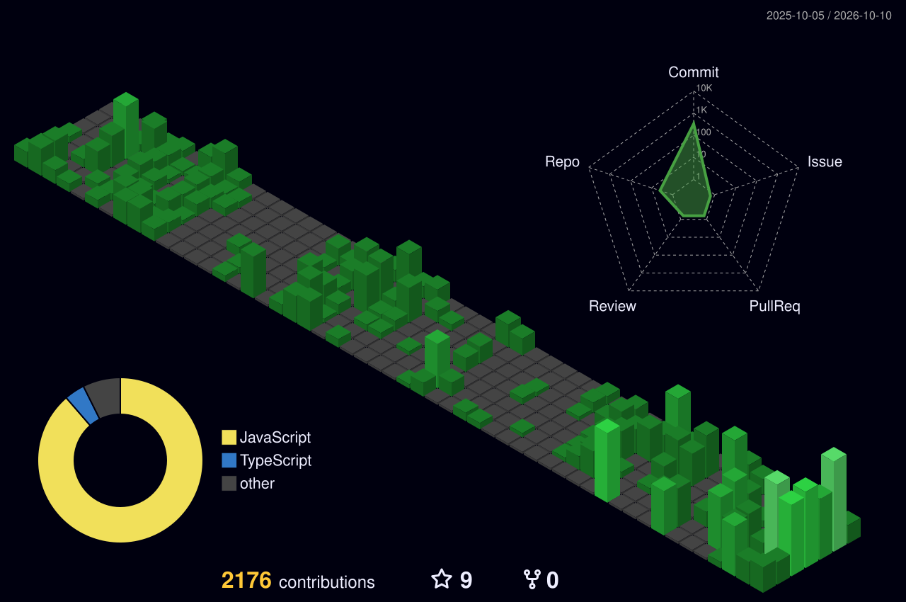

<!-- ===================================================== -->
<!--                    HERO SECTION                       -->
<!-- ===================================================== -->

<h1 align="center">Hi 👋, I'm Jay Gupta</h1>

<h3 align="center">
Full Stack Developer • Software Developer • Frontend Engineer • UI/UX Designer
</h3>

  

  

  

<!-- ===================================================== -->
<!--                     ABOUT ME                          -->
<!-- ===================================================== -->

## 👨‍💻 About Me

I'm a Full Stack Developer and UI/UX Designer focused on building
modern, scalable and visually engaging web applications.

- 🚀 Building products with **React, Next.js & Node.js**
- 🎨 Passionate about **UI/UX and interactive web experiences**
- ⚙️ Working with **REST APIs, MongoDB & cloud platforms**
- 🤖 Exploring **AI-powered applications**
- ☁️ Learning **scalable SaaS & cloud architecture**
- 💡 Turning ideas into **real-world digital products**

<!-- ===================================================== -->
<!--                    TECH STACK                         -->
<!-- ===================================================== -->

## 🛠️ Tech Stack

####################################### 🎨 Frontend

  

### ⚙️ Backend & Database

  

### 🧰 Tools & Platforms

  

### 🤖 AI / ML

  

<!-- ===================================================== -->
<!--                  LIVE PROJECTS                        -->
<!-- ===================================================== -->

## 🚀 Live Projects

<table>
<tr>

<!-- PORTFOLIO -->

<td width="50%">

<h3 align="center">🎨 Creative Portfolio</h3>

  

Personal developer portfolio featuring interactive UI,
smooth animations, creative sections and modern web experiences.

<b>React • Framer Motion • GSAP • UI/UX</b>

</td>

<!-- FOX CREATION -->

<td width="50%">

<h3 align="center">🦊 Fox Creation</h3>

  

Clothing brand website built to showcase products,
brand identity and provide a modern shopping experience.

<b>React • Next.js • E-commerce • UI/UX</b>

</td>

</tr>

<tr>

<!-- MACHINERY MANAGEMENT -->

<td width="50%">

<h3 align="center">⚙️ Machinery Management</h3>

  

SaaS-based machinery management platform for managing
machines, AMC, servicing, maintenance and related operations.

<b>React • Node.js • MongoDB • SaaS</b>

</td>

<!-- SANSKAR DHANI GARBA -->

<td width="50%">

<h3 align="center">🎟️ Sanskar Dhanigarba</h3>

  

Complete Garba ticketing platform with online booking,
ticket generation, QR scanning, check-in, check-out and payments.

<b>Next.js • Node.js • QR System • Payment Gateway</b>

</td>

</tr>

<tr>

<!-- STUTI SYSTEMS -->

<td width="50%">

<h3 align="center">🛒 Stuti Systems</h3>

  

Complete full-stack e-commerce platform with user authentication,
product management, cart, orders, payments and a dedicated admin portal.

<b>React • Node.js • MongoDB • Payment Gateway • Admin Portal</b>

</td>

<!-- MORE PROJECTS -->

<td width="50%">

<h3 align="center">💡 More Projects Coming Soon</h3>

   
   
  🚀 Building more real-world products
   
   
  <b>Stay tuned!</b>
   
   

</td>

</tr>

</table>

<!-- ===================================================== -->
<!--              CURRENTLY WORKING ON                     -->
<!-- ===================================================== -->

## 🎯 Currently Working On

- 🚀 Building scalable **SaaS applications**
- ⚡ Developing modern **React & Next.js applications**
- 🔧 Working on **Node.js backend architecture**
- 🤖 Exploring **AI-powered developer tools**
- 🌐 Building real-world products for clients

<!-- ===================================================== -->
<!--                CURRENTLY LEARNING                     -->
<!-- ===================================================== -->

## 📚 Currently Learning

- 🏗️ Scalable Backend Architecture
- ☁️ Cloud & SaaS Architecture
- 🤖 AI Application Development
- 🔐 Advanced Authentication & Security
- 📦 System Design
- 🚀 Production-ready application architecture

<!-- ===================================================== -->
<!--                  GITHUB STREAK                        -->
<!-- ===================================================== -->

## 🔥 GitHub Streak

<!-- ===================================================== -->
<!--               3D CONTRIBUTION GRAPH                  -->
<!-- ===================================================== -->

## 📈 3D Contribution Graph

  

<!-- ===================================================== -->
<!--                 CONTRIBUTION SNAKE                    -->
<!-- ===================================================== -->

## 🐍 Contribution Snake

<picture>

  <source
    media="(prefers-color-scheme: dark)"
    srcset="https://raw.githubusercontent.com/jaygupta930/jaygupta930/output/github-snake-dark.svg"
  />

  <source
    media="(prefers-color-scheme: light)"
    srcset="https://raw.githubusercontent.com/jaygupta930/jaygupta930/output/github-snake.svg"
  />

  

</picture>

<!-- ===================================================== -->
<!--                    LET'S CONNECT                      -->
<!-- ===================================================== -->

## 🤝 Let's Connect

I'm always open to interesting projects, collaborations,
and conversations about technology.

### ⭐ Thanks for visiting my profile!

